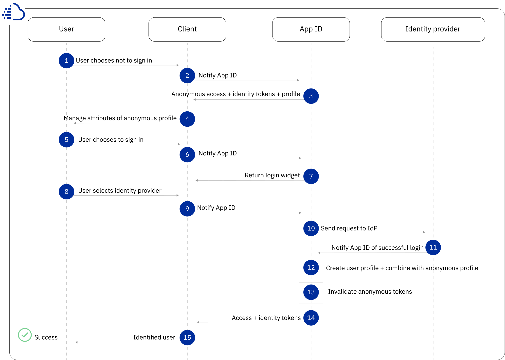

---

copyright:
  years: 2017, 2021
lastupdated: "2021-06-21"

keywords: anonymous authentication, progressive authentication, profile, user profile, authorization, sign in, secure app, identity provider, authorization

subcollection: appid

---

{:codeblock: .codeblock}
{:screen: .screen}
{:download: .download}
{:external: target="_blank" .external}
{:faq: data-hd-content-type='faq'}
{:gif: data-image-type='gif'}
{:important: .important}
{:note: .note}
{:pre: .pre}
{:tip: .tip}
{:preview: .preview}
{:deprecated: .deprecated}
{:beta: .beta}
{:term: .term}
{:shortdesc: .shortdesc}
{:script: data-hd-video='script'}
{:support: data-reuse='support'}
{:table: .aria-labeledby="caption"}
{:troubleshoot: data-hd-content-type='troubleshoot'}
{:help: data-hd-content-type='help'}
{:tsCauses: .tsCauses}
{:tsResolve: .tsResolve}
{:tsSymptoms: .tsSymptoms}
{:java: .ph data-hd-programlang='java'}
{:javascript: .ph data-hd-programlang='javascript'}
{:swift: .ph data-hd-programlang='swift'}
{:curl: .ph data-hd-programlang='curl'}
{:video: .video}
{:step: data-tutorial-type='step'}
{:tutorial: data-hd-content-type='tutorial'}
{:ui: .ph data-hd-interface='ui'}
{:cli: .ph data-hd-interface='cli'}
{:api: .ph data-hd-interface='api'}

# Anonymous authentication
{: #anonymous}

With {{site.data.keyword.appid_full}}, you can allow users to anonymously browse your application under an anonymous user profile. If the user chooses to sign in, you can allow them to still access their anonymous attributes by attaching their anonymous profile to their user identity with {{site.data.keyword.appid_short_notm}}.
{: shortdesc}

## Understanding the progressive authentication flow
{: #progressive}

When a user chooses not to sign in immediately, they are considered an anonymous user. In an example of you as an online retailer, an anonymous user can have limited interactions with your app such as adding objects to a shopping cart. However, you may require users to sign in to check out the items in the shopping cart. When a user chooses to sign in, you can ensure a positive user experience by letting users access the same objects placed in their shopping carts before they signed in. 

You can use {{site.data.keyword.appid_short_notm}} to create a user profile and issue anonymous access and identity tokens for anonymous users. Using these tokens, you can customize the user's experience of your app by managing the attributes that are stored in the anonymous user profile. When the user signs in, you can link their anonymous profile with their user profile. 

You can assign an identity to an anonymous profile only if it is not already assigned to another user.
{: tip}

If the identity is already associated with another {{site.data.keyword.appid_short_notm}} user, the tokens contain information of that user profile and provide access to their attributes. The previously anonymous user's attributes are not accessible through the new token. Until the token expires, the user can still access information through the anonymous access token. While you develop your app, you can choose how to merge the anonymous attributes to the known user.

### What does the progressive authentication flow look like? 

In the following image, you can see the direction of communication that defines the progressive authentication flow between the user, your application, {{site.data.keyword.appid_short_notm}}, and the identity provider.

{: caption="Figure 1. Progressive authentication flow of anonymous user" caption-side="bottom"}

1. The user interacts with areas of your app that do not require authentication. 
2. Your application notifies {{site.data.keyword.appid_short_notm}} that the user wants to interact with your app as an anonymous user. 
3. {{site.data.keyword.appid_short_notm}} creates an ad hoc user profile and calls the OAuth login that issues anonymous access identity tokens for the anonymous user. 
4. Using the tokens from {{site.data.keyword.appid_short_notm}}, you can create, read, update, and delete the attributes that are store in the user profile. 
5. The user may choose to sign in to access additional features of your app.
6. Your application notifies {{site.data.keyword.appid_short_notm}} that the user wants to interact with your app as an identified user. 
7. {{site.data.keyword.appid_short_notm}} returns the login widget to your app. 
8. The user selects their preferred identity provider. 
9. Your application informs {{site.data.keyword.appid_short_notm}} that the user has selected an identity provider.
10. {{site.data.keyword.appid_short_notm}} authenticates the call with the identity provider. 
11. The identity provider confirms whether the login was successful. 
12. {{site.data.keyword.appid_short_notm}} uses the anonymous access token to find the anonymous profile and attaches the user's identity to it.
13. After {{site.data.keyword.appid_short_notm}} creates the new tokens, the service invalidates the user's anonymous token. 
14. {{site.data.keyword.appid_short_notm}} returns the new access and identity tokens. The new tokens contain the public information that is shared by the identity provider and the attributes of the user's former anonymous profile. 
15. When the user successfully signs in, they become an identified user. 
